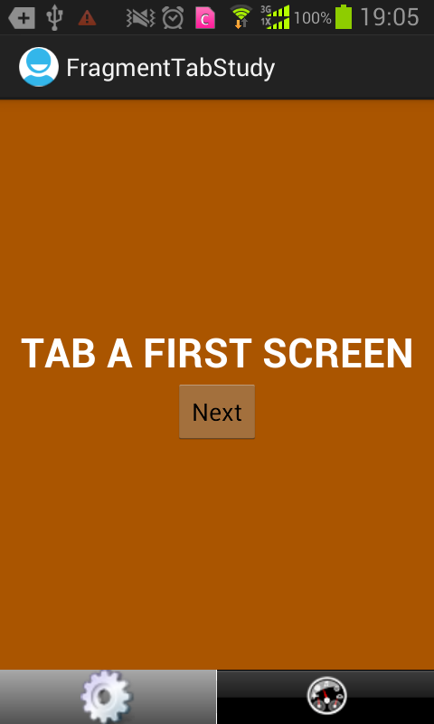
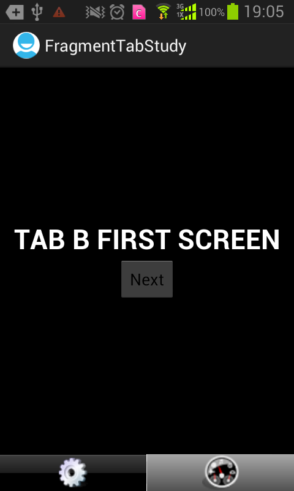

AndroidSource
=============

收藏Android开源项目

### 001 ViewFlipper ###

应用场景：浏览照片自动播放等

### 002 Viewpagerindicator ###
应用场景：新手入门向导、首部导航等

### 003 FragmentTabStudy ###
应用场景：框架设计很多需要类似的导航功能

### 004 bitmapfun 
应用场景：介绍了图片有效加载问题，用到了DiskLruCache

### 005 android-volley android_volley_examples
应用场景：解决了数据处理各种疑难问题

### 006 Shelves
应用场景：数据处理和UI设计可以借鉴

### 007 360FloatWindowDemo
应用场景：浮动层类似360奇艺桌面小图标，可以拖动

